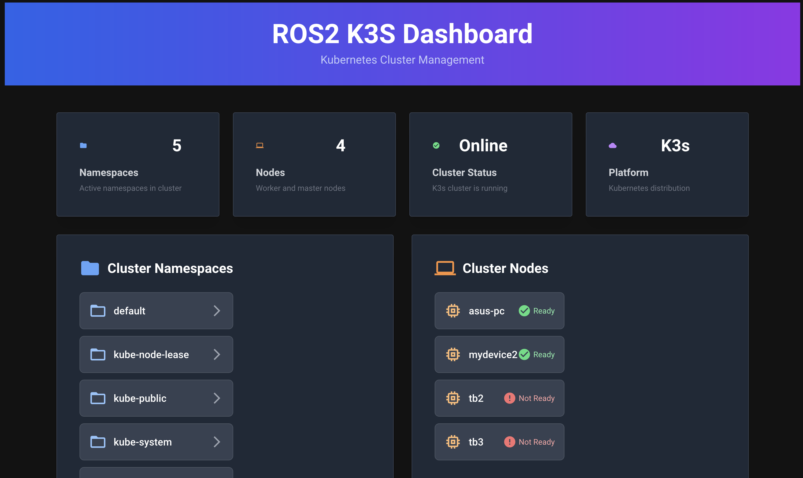

# ros2-k3s
Repo for using k3s with ROS2




## How to Run ros2_k3s_cli

1. Build the workspace:

```bash
colcon build --symlink-install
```

2. Source the ROS2 workspace:

```bash
source install/setup.bash
```

3. Run the CLI tool:

```bash
ros2 run ros2_k3s_cli cli --help
```

### Generate Robot Pod Config

Interactively create a robot pod YAML config:

```bash
ros2 run ros2_k3s_cli cli create-config --output robot_pod_generated.yaml
```

You will be prompted for name, image, command, namespace, and can select deployment (edge/local) using arrow keys.

### Example Commands

#### Cluster Initialization

- Initialize cluster as server:
  ```bash
  ros2 run ros2_k3s_cli cli init --server
  ```
- Initialize cluster as agent:
  ```bash
  ros2 run ros2_k3s_cli cli init --agent --token <your-token> --url <server-url>
  ```

#### Cluster Resource Management

- **Interactive mode** - Browse namespaces, pods, and view logs:
  ```bash
  ros2 run ros2_k3s_cli cli get
  ```
  This will:
  1. Show all namespaces and let you select one using arrow keys
  2. Display all pods in the selected namespace in a table format
  3. Let you select a pod using arrow keys
  4. Show the logs from the selected pod (last 5 seconds)

- Get all namespaces:
  ```bash
  ros2 run ros2_k3s_cli cli get namespace
  ```
- Get pods in a specific namespace:
  ```bash
  ros2 run ros2_k3s_cli cli get pod -n <namespace>
  ```

#### Application Deployment

- Validate cluster config:
  ```bash
  ros2 run ros2_k3s_cli cli validate --config cluster.yaml
  ```
- Apply (deploy) application:
  ```bash
  ros2 run ros2_k3s_cli cli deploy --config src/ros2-k3s/examples/ros2_sub.yaml
  ```

Replace `<your-token>`, `<namespace>`, `cluster.yaml` and the config path with your actual values and configuration files.

## Web Dashboard (ros2_k3s_web)

A modern NiceGUI-based dashboard is now available for cluster monitoring:

- **Cluster Overview**: View namespaces, nodes, and cluster status in a modern UI
- **Node Status**: See real-time node health (Ready/NotReady/Unknown)
- **Namespace Browsing**: Click namespaces to view running pods
- **Pod Details**: See pod status, container readiness, creation time, and assigned node
- **Resource Monitoring**: View live CPU and RAM usage for ready pods; refresh metrics on demand
- **Accurate Pod Health**: Pods are only considered healthy if all containers are ready
- **Visual Feedback**: Color-coded status, warnings for non-ready pods, and error handling

To run the dashboard:

```bash
ros2 run ros2_k3s_web web_app
```

